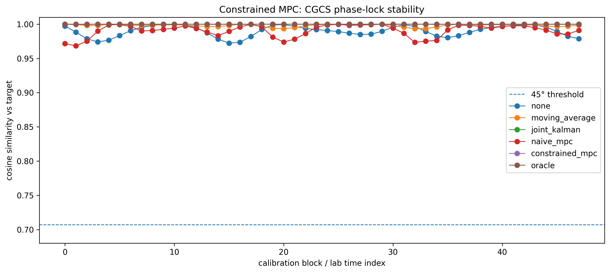
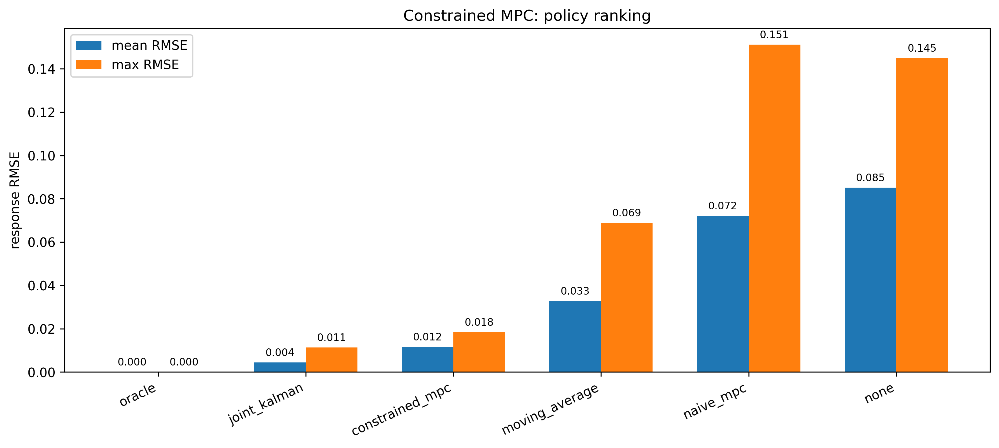
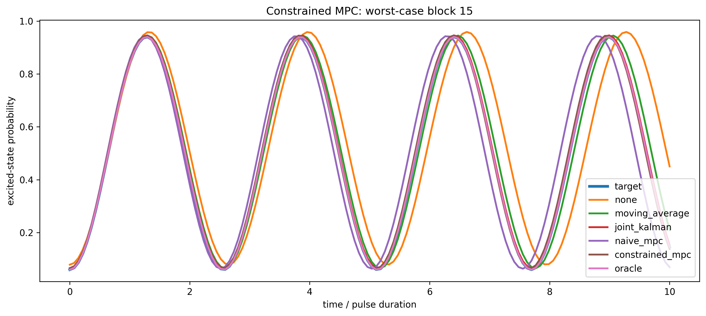
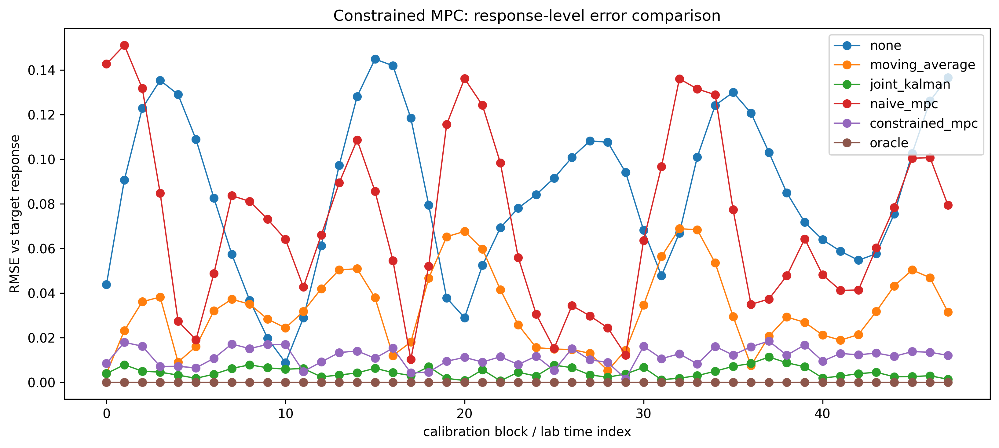
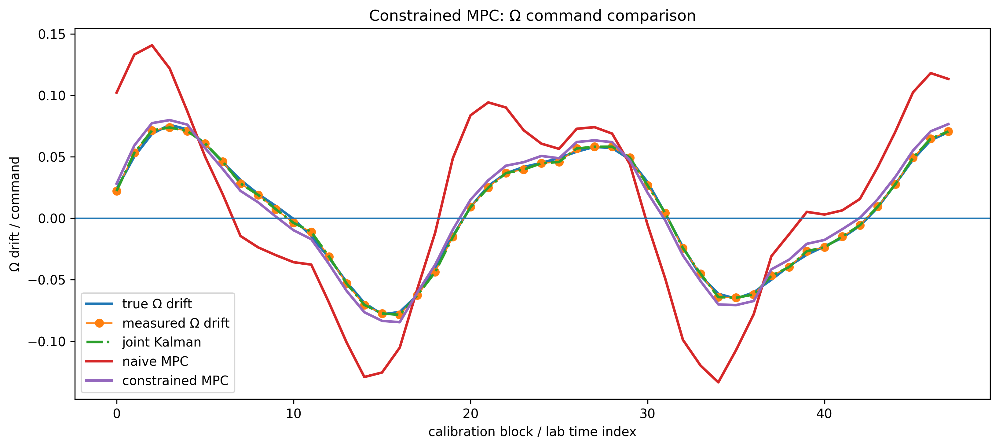
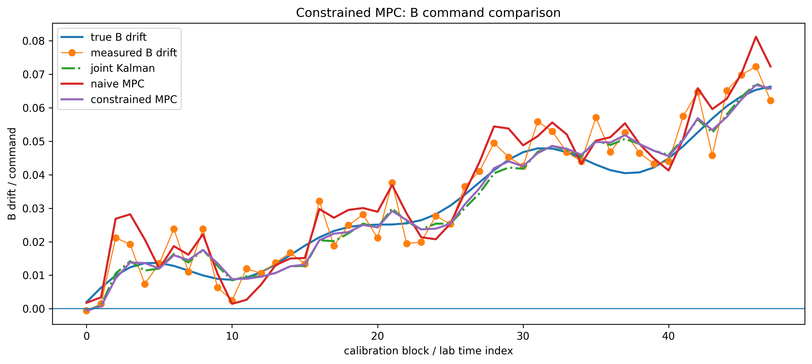
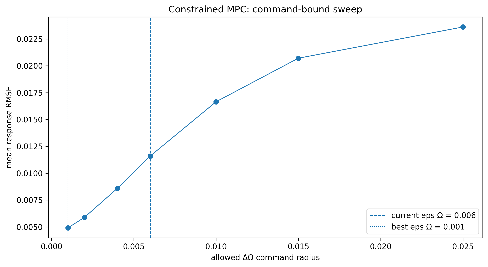
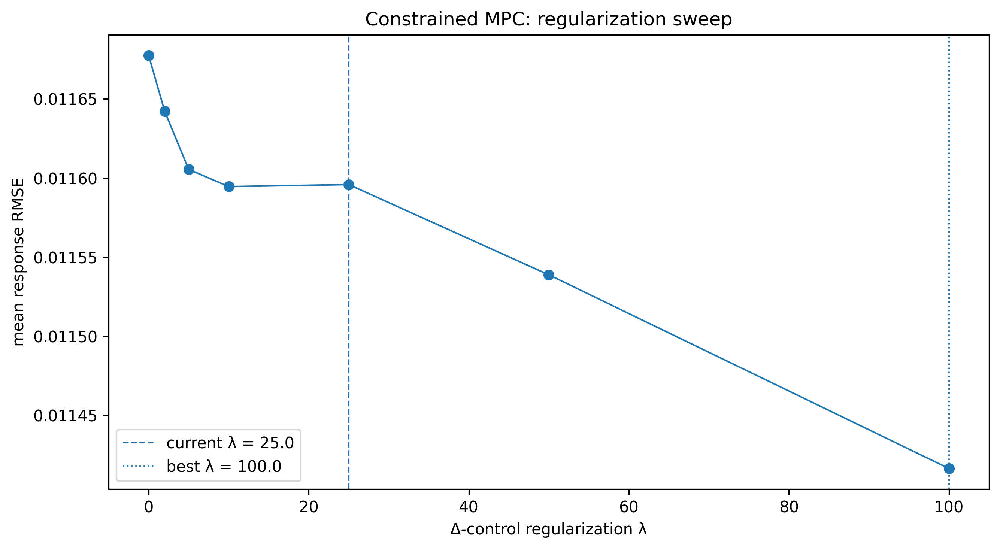

# Constrained MPC

This notebook extends predictive control (Notebook 06) by introducing **bounded control updates**:

- ΔΩ, ΔB constraints (ε)
- control regularization (λ)
- short-horizon MPC (H = 1)

---

## Model

State:

    x = [Ω, B]^T

Objective:

    minimize tracking error + λ · Δ-control penalty

Constraints:

    |ΔΩ| ≤ εΩ  
    |ΔB| ≤ εB  

---

## Phase-Lock Stability (CGCS)

All policies satisfy:

    cos(θ) ≥ 1 / √(1² + 1²) ≈ 0.7071

Constrained MPC remains tightly near 1.

---

## Policy Ranking

- joint_kalman remains best practical method
- constrained_mpc improves over naive_mpc
- naive_mpc unstable under noise

---

## Worst-Case Block

- naive MPC overshoots
- constrained MPC stabilizes
- Kalman aligns with oracle

---

## Response-Level Error

- constrained MPC removes large spikes
- still higher RMSE than Kalman

---

## Ω Command Comparison

- naive MPC oscillates
- constrained MPC smooths control
- Kalman remains lowest-noise

---

## B Command Comparison

- same structure as Ω
- constraints prevent overshoot

---

## Constraint Sweep (ε)

- best εΩ ≈ 0.001
- current εΩ = 0.006 too loose

---

## Regularization Sweep (λ)

- best λ ≈ 100
- higher λ improves stability

---

## Key Takeaways

- constraints fix MPC instability
- prediction alone is not enough
- estimator quality dominates performance
