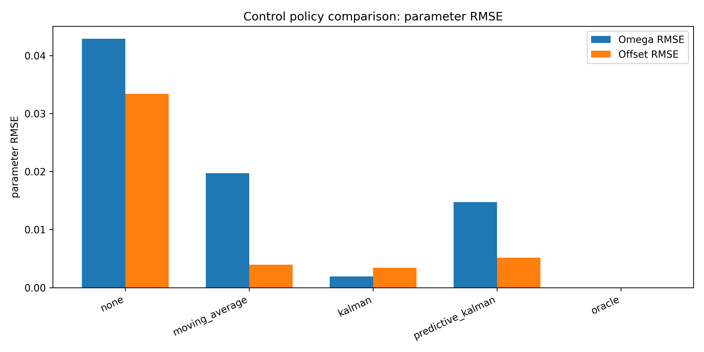
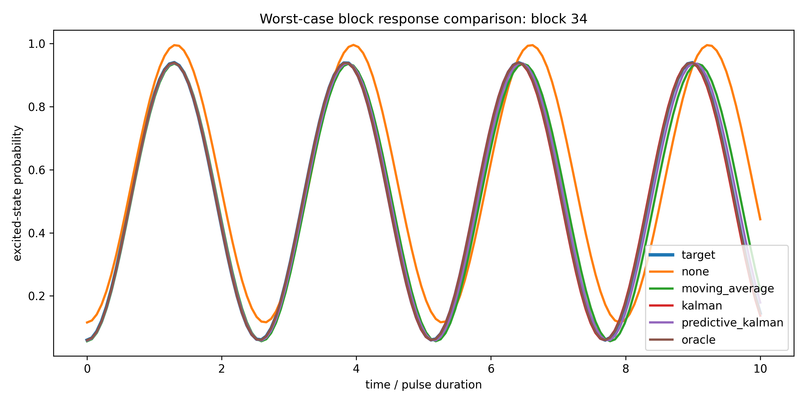
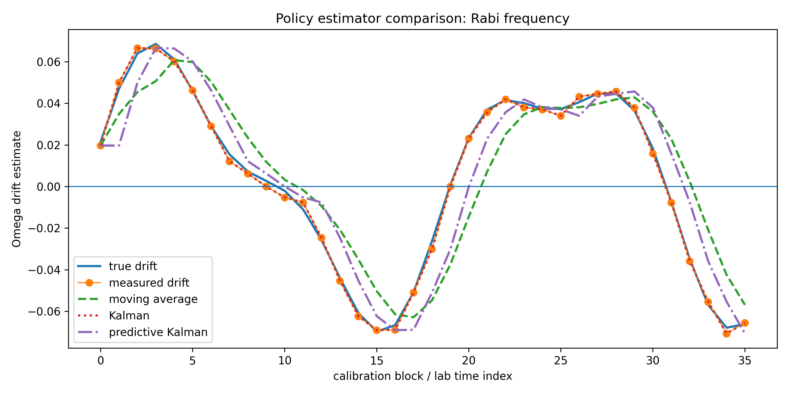
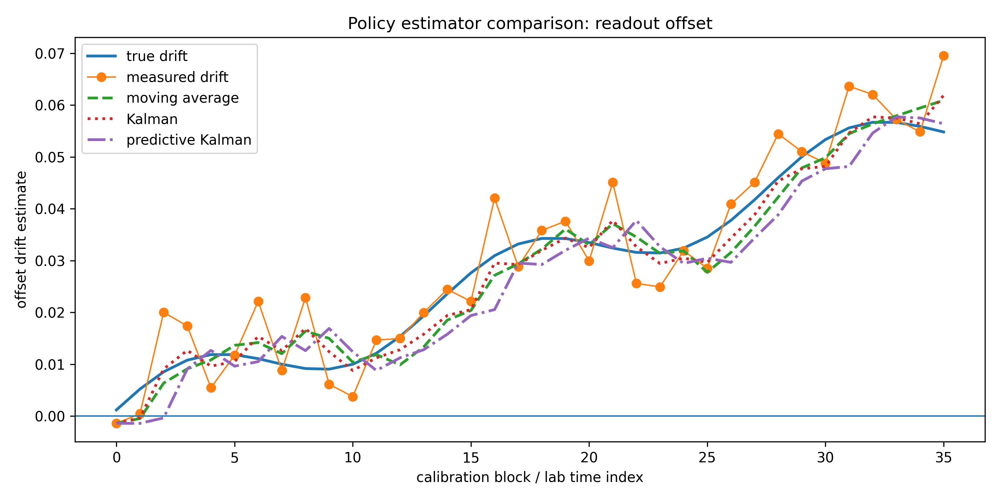
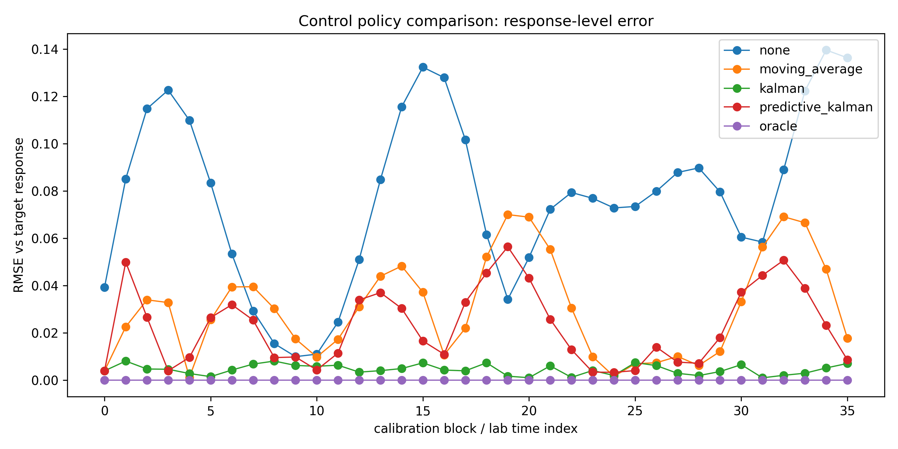
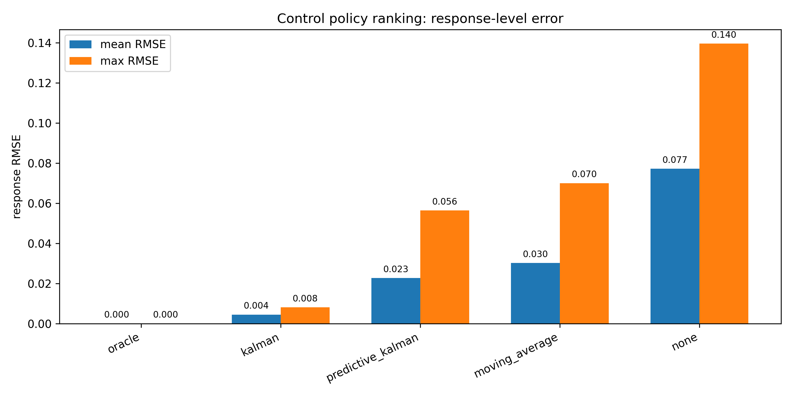
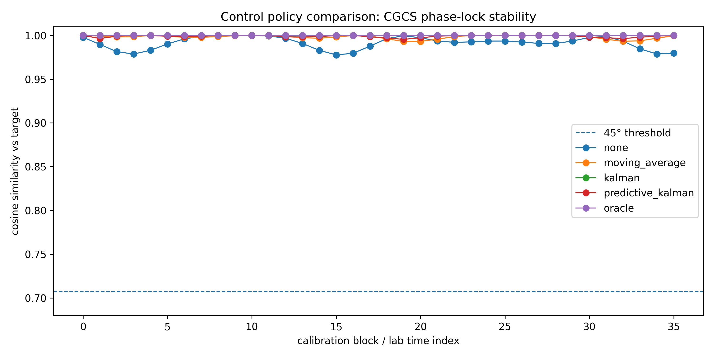

# Control Policy Comparison (Control Stack)

Evaluation of control strategies for stabilizing quantum calibration under drift.

---

## Pipeline

calibration → drift estimation → control policy → stabilized response

This notebook compares multiple control strategies:

- no control (baseline)
- moving-average compensation
- Kalman filter control
- predictive Kalman control
- oracle (ideal reference)

---

## Key Results

Control policy strongly affects:

- parameter estimation accuracy (Ω, B)
- response-level error (observable physics)
- robustness to worst-case drift
- phase-lock stability

---

## Figures

### Parameter RMSE comparison

Kalman control significantly reduces parameter error compared to moving average and no control.

---

### Worst-case block response

Worst-case deviations are minimized under Kalman control and nearly eliminated under oracle.

---

### Frequency (Ω) estimation comparison

Kalman tracks oscillatory drift accurately, while moving average lags and smooths out structure.

---

### Offset (B) estimation comparison

Kalman provides smooth and accurate tracking of slow drift components.

---

### Response-level error over time

Kalman maintains low error across all calibration blocks; predictive model shows intermediate performance.

---

### Policy ranking summary

Ranking (best → worst):

- oracle
- Kalman
- predictive Kalman
- moving average
- no control

---

### CGCS phase-lock stability

- All policies remain above phase-lock threshold
- Kalman maintains strongest stability margin

---

## Interpretation

Control policy determines system performance once drift is present.

- Moving average:
  - simple but lagged
  - limited by smoothing window

- Kalman filter:
  - optimal estimator under noise assumptions
  - balances responsiveness and noise suppression
  - best practical controller

- Predictive Kalman:
  - introduces forecasting
  - limited by simple state model (no velocity term)

- Oracle:
  - ideal reference (true drift known)
  - establishes performance ceiling

---

## Key Insight

Drift estimation alone is insufficient.

**Control policy selection determines final system performance.**

---

## Limitations

Current predictive model:

- assumes static drift dynamics
- lacks velocity / acceleration modeling
- underperforms relative to standard Kalman

---

## Next Step

Upgrade estimator to state-space dynamics:

→ `04_velocity_state_kalman.ipynb`

This will:

- introduce drift velocity modeling
- improve predictive accuracy
- reduce response error further
