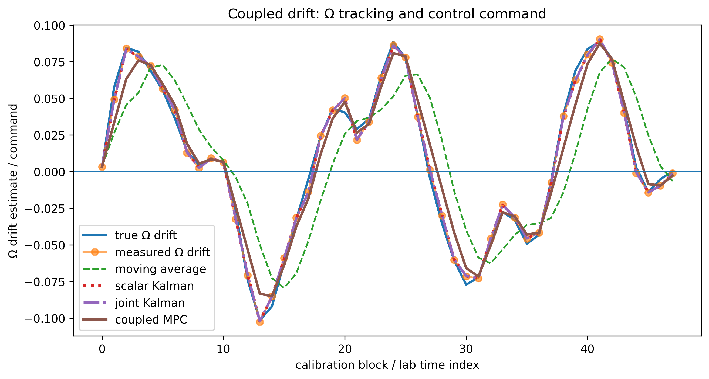
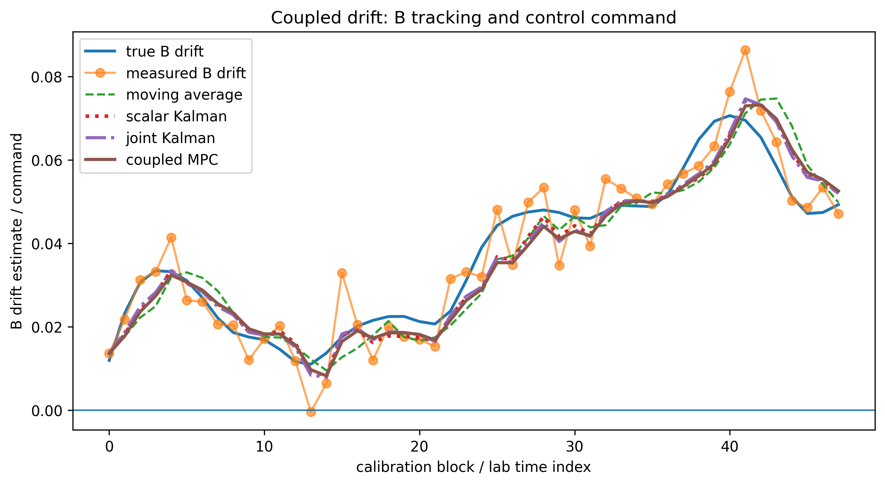
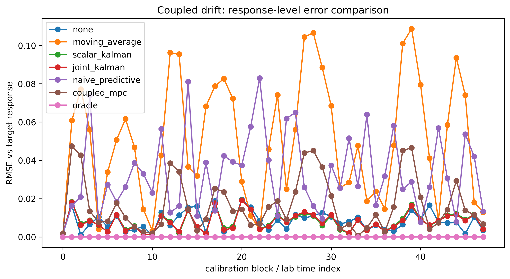
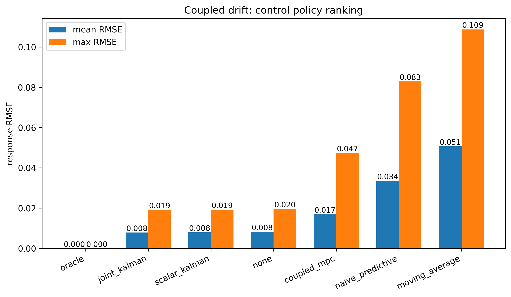
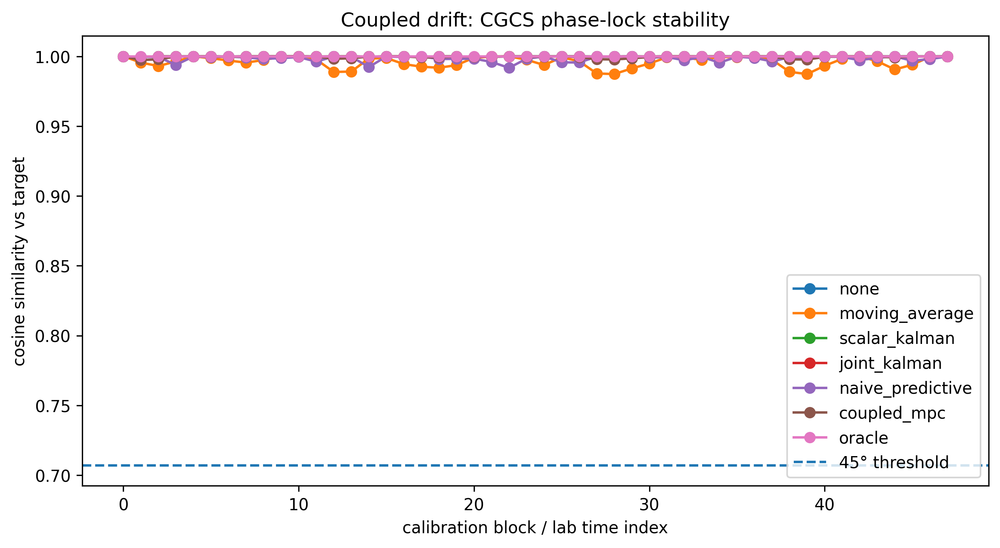
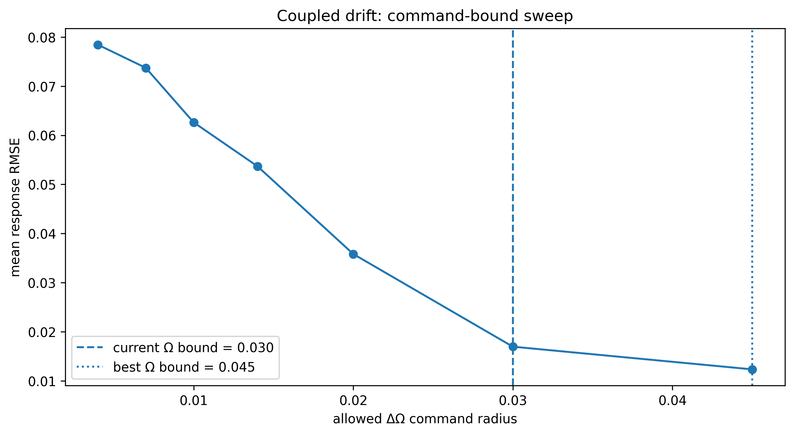
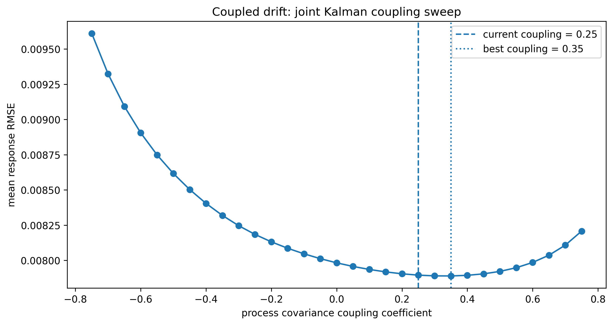
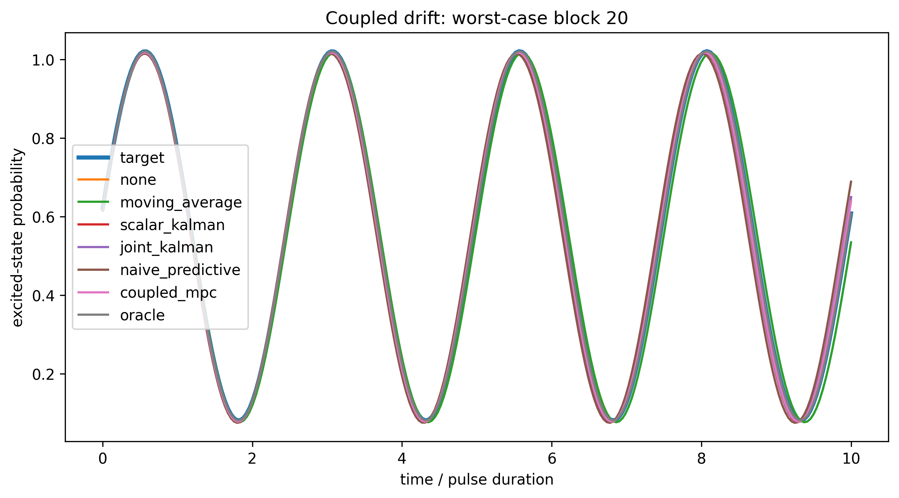

# Coupled Drift MPC (Notebook 09)

Coupled drift introduces correlated fluctuations between Ω and B. This notebook evaluates estimation and control strategies under cross-covariance structure.

---

## Pipeline

coupled drift → joint estimation → bounded control → response stabilization

---

## Key Results

- Joint Kalman remains the best practical estimator/controller.
- Coupled MPC improves over naive predictive control.
- Moving average performs poorly under coupled drift.
- All policies remain above the CGCS 45° phase-lock threshold.

---

## Figures

### Ω tracking and control command

Joint Kalman and coupled MPC track Ω under correlated drift. Moving average lags.

---

### B tracking and control command

Coupled estimation improves B tracking stability during correlated excursions.

---

### Response-level error comparison

Joint Kalman achieves lowest non-oracle error. Coupled MPC reduces error relative to naive predictive and moving-average baselines.

---

### Policy ranking

Policy ranking shows estimator quality dominates response-level control performance.

---

### CGCS phase-lock stability

All methods remain above the 45° threshold:

    cos(θ) ≥ 1 / √(1² + 1²) ≈ 0.7071

---

### Command-bound sweep

Increasing allowed ΔΩ reduces RMSE. The best tested bound is near ΔΩ ≈ 0.045.

---

### Joint Kalman coupling sweep

Optimal coupling is near 0.35, improving slightly over the current coupling of 0.25.

---

### Worst-case block comparison

Coupled MPC reduces lag and improves alignment in the worst-case block.

---

## Interpretation

Coupled drift makes estimator structure more important than controller complexity.

Joint Kalman uses covariance structure to track Ω and B together. Coupled MPC can help, but only when the estimator already provides stable state estimates.

---

## Key Takeaway

Coupled drift is primarily **estimation-limited**, not control-limited.

---

## Next Step

Notebook 10:

- stress-test controllers under higher noise
- compare robustness under measurement bursts
- evaluate adaptive covariance tuning
