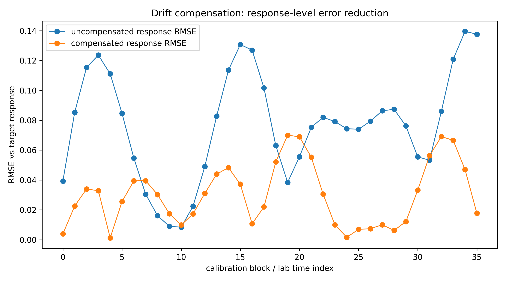
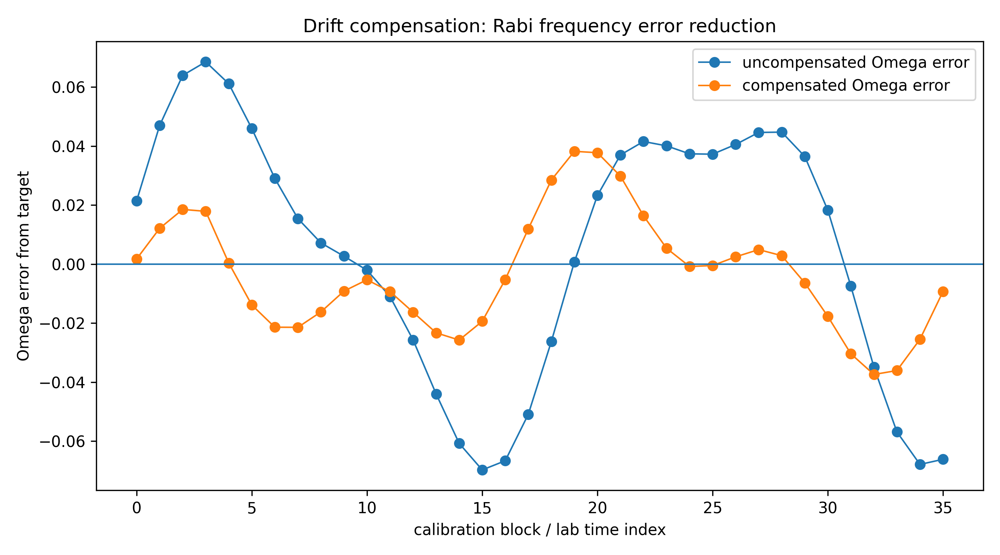
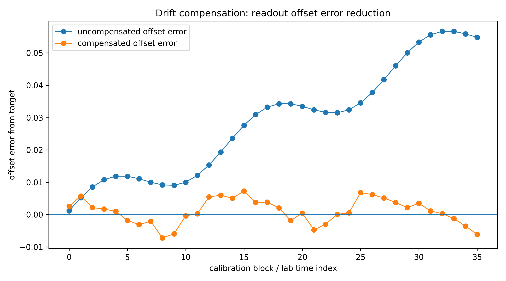
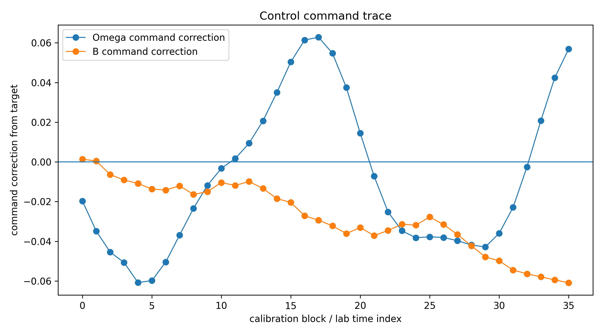
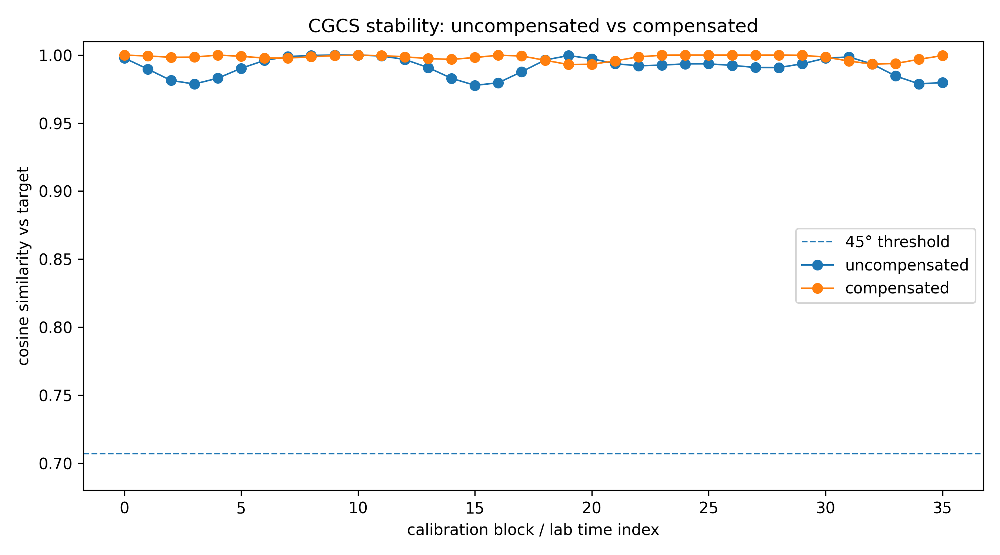
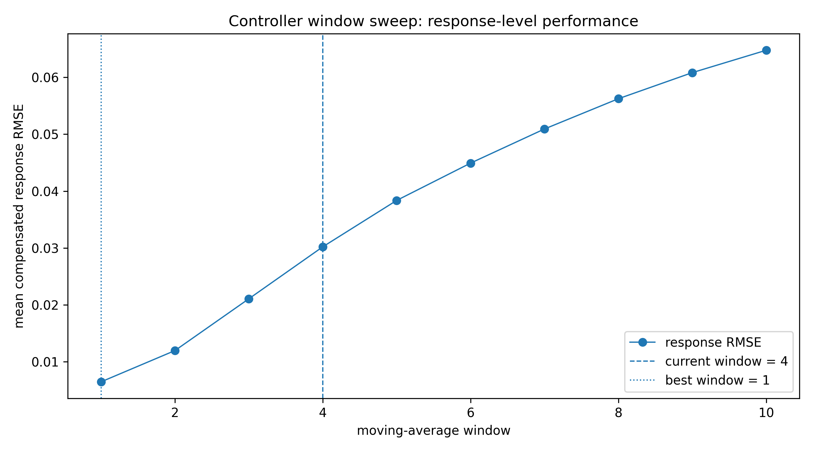
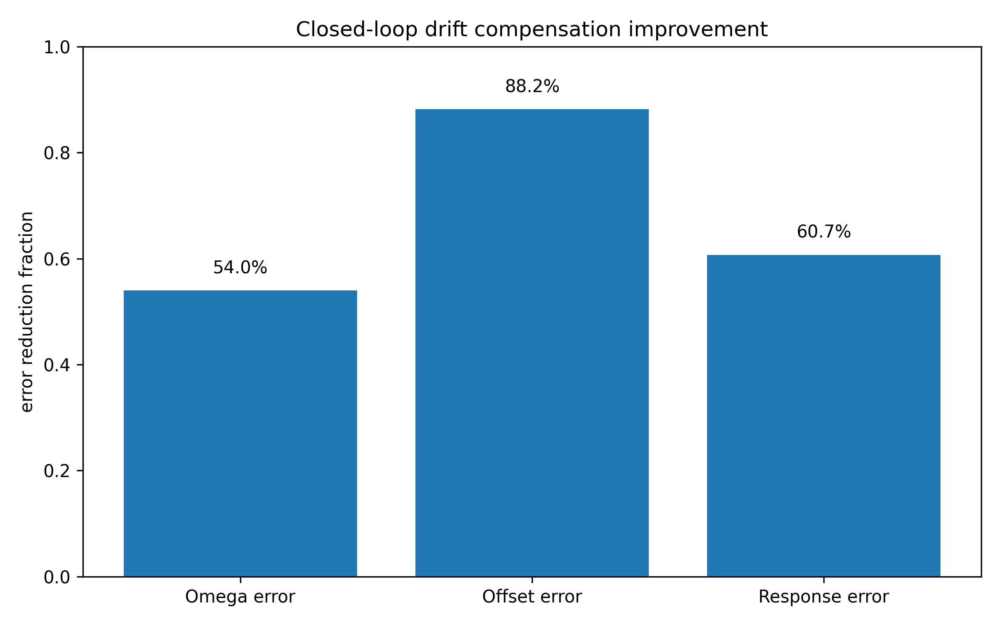

# Drift Compensation (Control Stack)

Closed-loop stabilization of quantum calibration parameters under drift.

---

## Pipeline

calibration → drift estimation → control update → stabilized response

---

## Key Results

- Stabilizes calibration drift.
- Reduces response-level error.
- Preserves CGCS phase-lock stability.

---

## Figures

### Response-level error reduction

Compensation reduces response RMSE, keeping measured signals aligned with target behavior.

---

### Frequency (Ω) error reduction

Control reduces frequency drift error amplitude and variance.

---

### Offset (B) error reduction

Offset drift is strongly suppressed, indicating smooth low-frequency drift tracking.

---

### Control command trace

The estimator produces smooth corrective commands applied to hardware parameters.

---

### CGCS phase-lock stability

All compensated blocks remain phase-locked and stability margin improves under control.

---

### Window sweep

Shows the tuning tradeoff between fast/noisy and smooth/lagged control.

---

### Improvement summary

Compact view of overall control effectiveness.

---

## Interpretation

Estimator quality and command constraints determine closed-loop response stability.

## Key Takeaway

Control performance is limited by estimator structure as much as controller design.

## Next Step

→ `02_kalman_drift_filter.ipynb`
