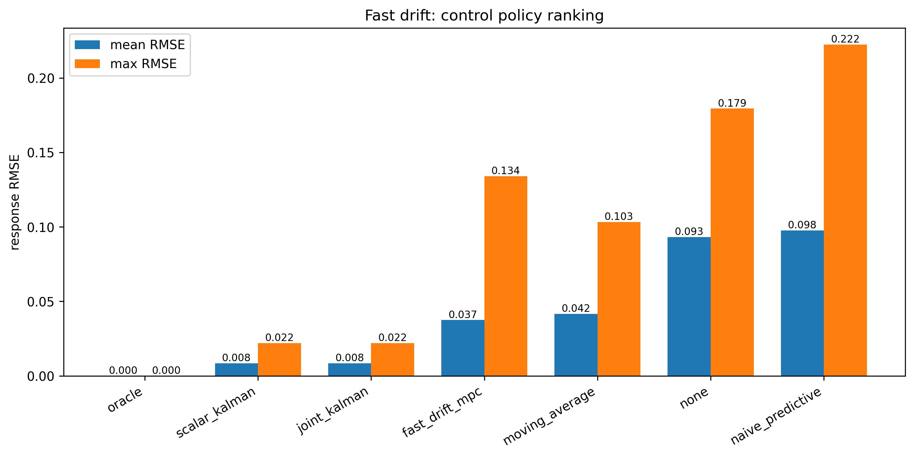

# 08 — Fast Drift MPC vs Kalman (CGCS Control Stack)

## Overview

This notebook studies **fast drift tracking** in Ω and B parameters under noisy measurement conditions, comparing:

- Moving average
- Scalar Kalman
- Joint Kalman
- Naive predictive
- Fast-drift MPC
- Oracle

Focus: **real-time calibration under rapid drift**

---

## System Model

- Fast sinusoidal drift in Ω
- Drift in B (offset)
- Measurement noise:
  - σ_Ω = 0.004
  - σ_B = 0.006

CGCS phase-lock constraint:

- cosine similarity ≥ 0.707 (45°)

---

## Ω Tracking and Control

- Kalman methods closely track true Ω
- Moving average lags
- MPC smooths but slightly under-tracks peaks

---

## Response-Level Error

- Kalman achieves lowest error
- MPC reduces spikes vs naive predictive
- Naive predictive shows instability

---

## Policy Ranking

| Method            | Mean RMSE |
|------------------|----------:|
| scalar_kalman     | 0.0085 |
| joint_kalman      | 0.0085 |
| fast_drift_mpc    | 0.0375 |
| moving_average    | 0.0416 |
| none              | 0.0932 |
| naive_predictive  | 0.0976 |

---

## MPC Horizon Sweep

- Best performance at **H = 0**
- Longer horizons degrade under fast drift

---

## CGCS Phase-Lock Stability

- All methods remain above 45° threshold
- Kalman ≈ perfect alignment
- MPC maintains safe envelope

---

## Worst-Case Block Behavior

- Naive predictive overshoots strongly
- MPC remains bounded
- Kalman tightly tracks

---

## B Drift Tracking

- Joint Kalman captures coupled dynamics
- MPC smooths control
- Moving average lags

---

## Command-Bound Sweep

- Larger bounds improve tracking
- Optimal ≈ 0.03

---

## Interpretation

### Kalman Filters
- Best estimators
- Minimal lag
- Highest CGCS alignment

### Fast-Drift MPC
- Constraint-aware control
- Smooth trajectories
- Slightly higher RMSE

### Naive Predictive
- Overshoot + instability
- Worst performer

---

## Takeaways

- Fast drift → **estimation-dominated regime**
- Kalman filtering is optimal baseline
- MPC becomes important when:
  - control bounds matter
  - hardware constraints apply

---

## Repo Context

Sequence:

- 06 → parameter phase diagram  
- 07 → constrained MPC  
- **08 → fast drift regime**

---

## Next

Notebook 09:

- multi-parameter coupling
- CGCS breakdown regimes
- control-estimation co-design
