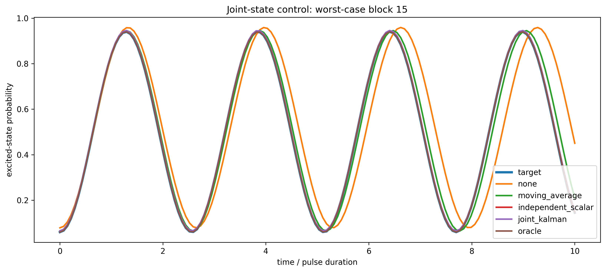
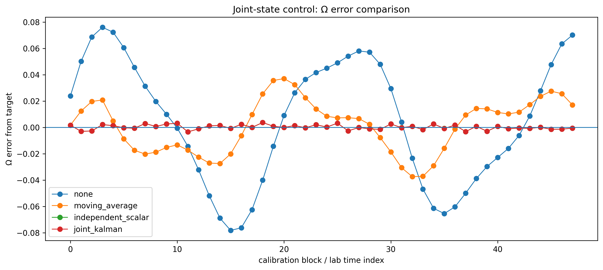
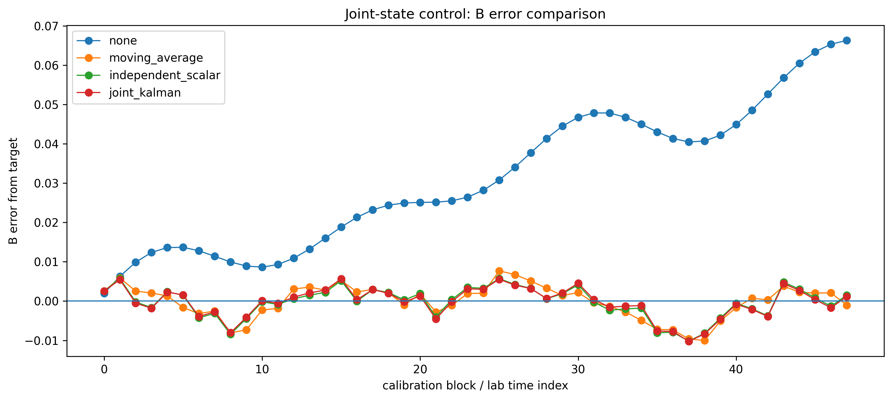
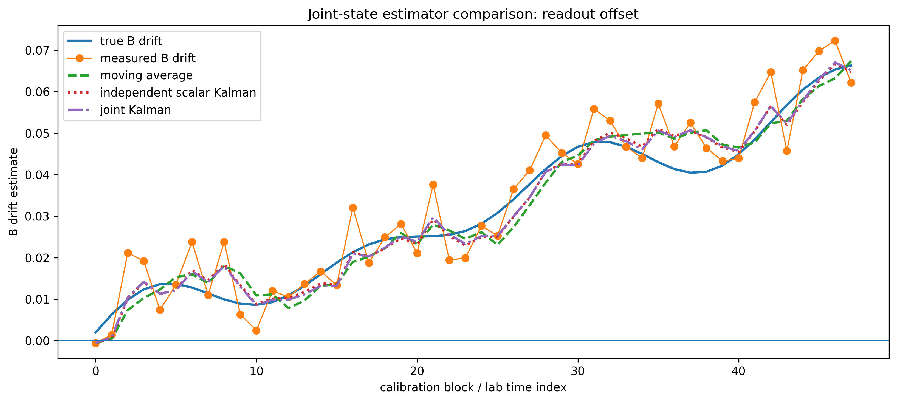
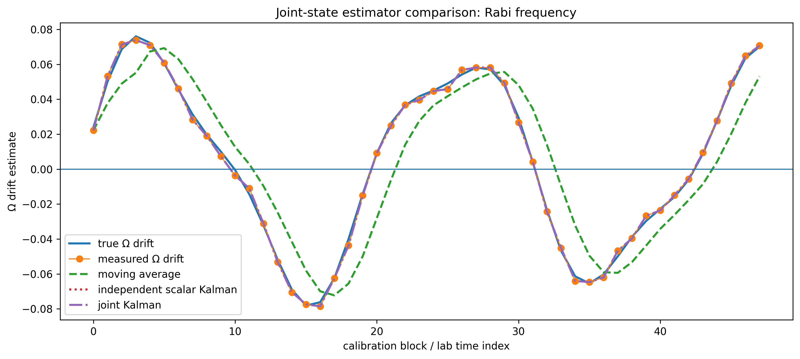
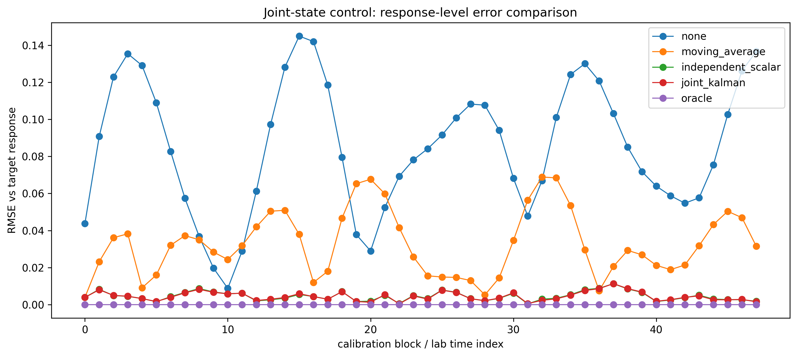
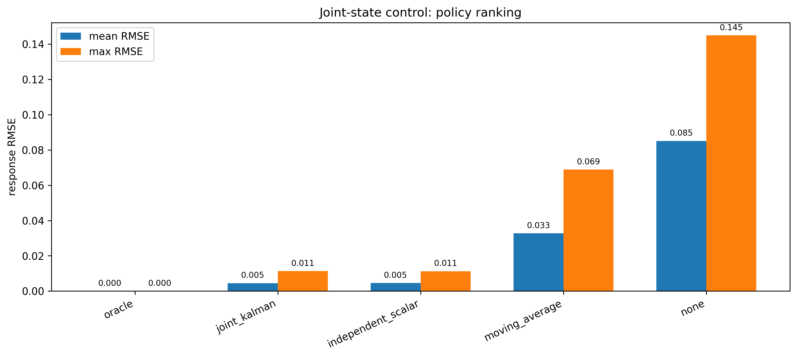
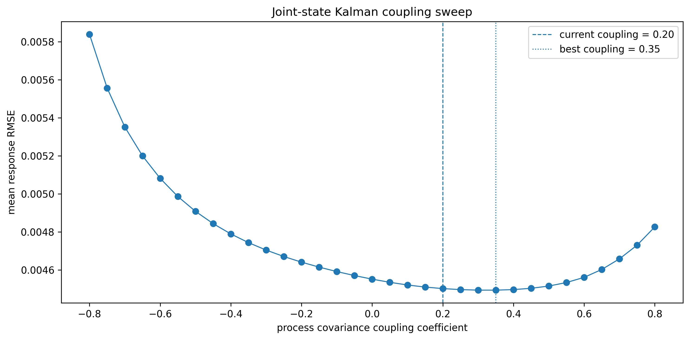
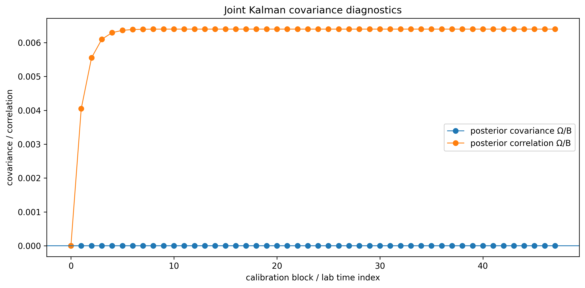
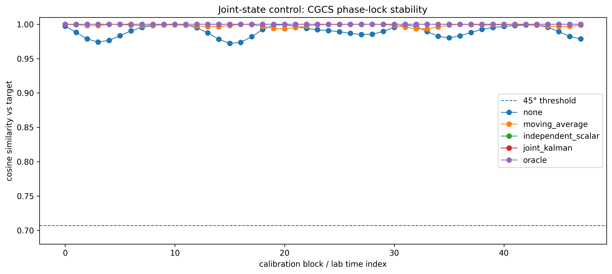

# Joint-State Kalman Control (Control Stack)

Joint-state Kalman filtering for coupled Ω and B drift estimation.

---

## Pipeline

coupled state estimate → covariance-aware update → joint correction → response stabilization

---

## Key Results

- Stabilizes calibration drift.
- Reduces response-level error.
- Preserves CGCS phase-lock stability.

---

## Figures

### Worst-case block comparison

Joint Kalman aligns closely with oracle in the worst-case block.

---

### Ω error comparison

Joint Kalman suppresses oscillatory Ω error.

---

### B error comparison

Joint Kalman stabilizes offset drift with near-scalar performance.

---

### Readout offset estimation

Measurement noise is reduced while the offset trend is preserved.

---

### Rabi frequency estimation

Joint and independent Kalman estimates overlap closely.

---

### Response-level error comparison

Joint Kalman consistently minimizes practical response RMSE.

---

### Policy ranking

Joint Kalman is the best practical method, with scalar Kalman nearly tied.

---

### Coupling sweep

Moderate covariance coupling improves estimator fit.

---

### Covariance diagnostics

Posterior covariance diagnostics expose estimator coupling behavior.

---

### CGCS phase-lock stability

All policies remain well above the 45° threshold.

---

## Interpretation

Estimator quality and command constraints determine closed-loop response stability.

## Key Takeaway

Control performance is limited by estimator structure as much as controller design.

## Next Step

→ `06_predictive_control.ipynb`
