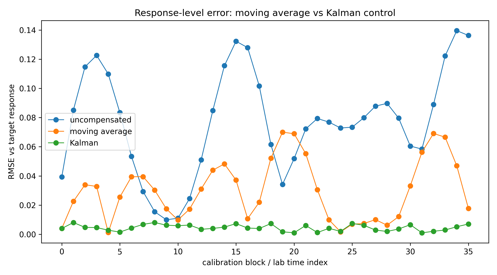
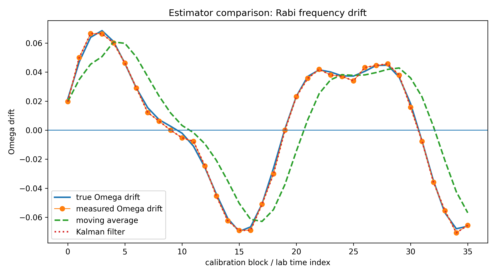
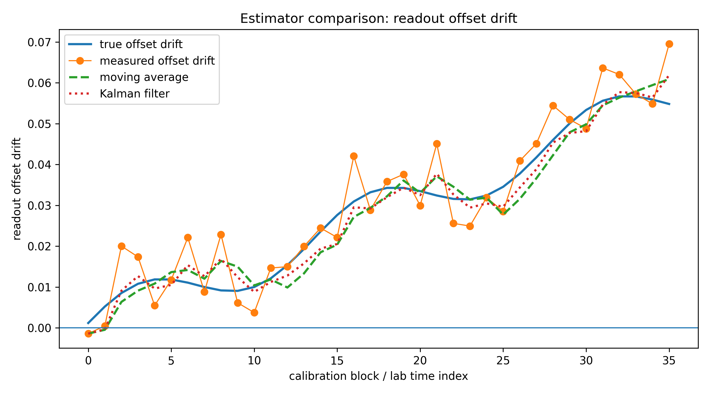
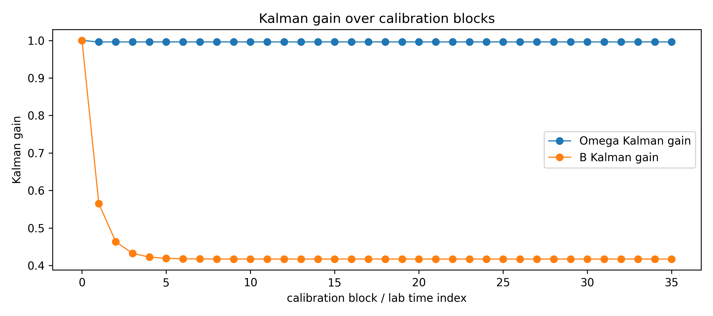
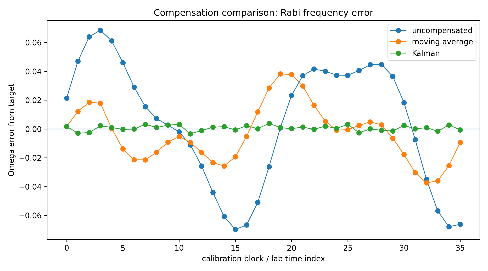
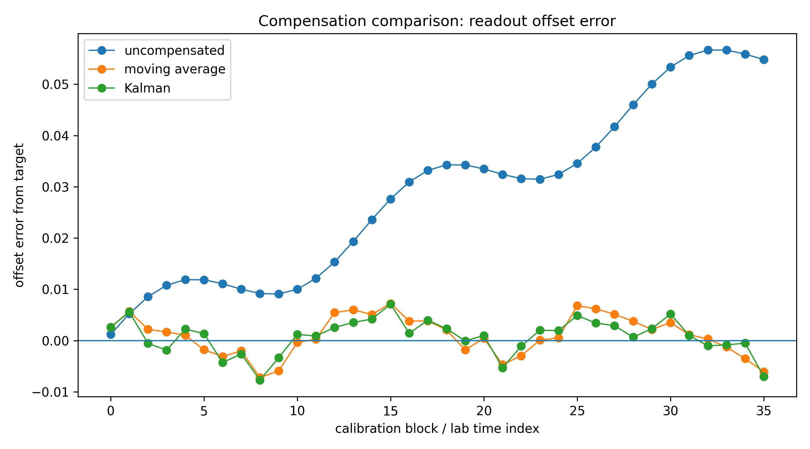
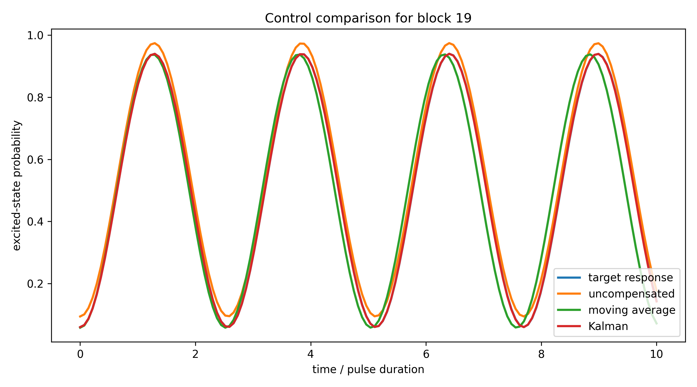
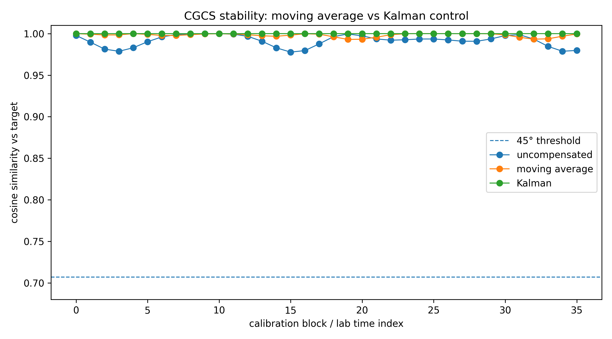
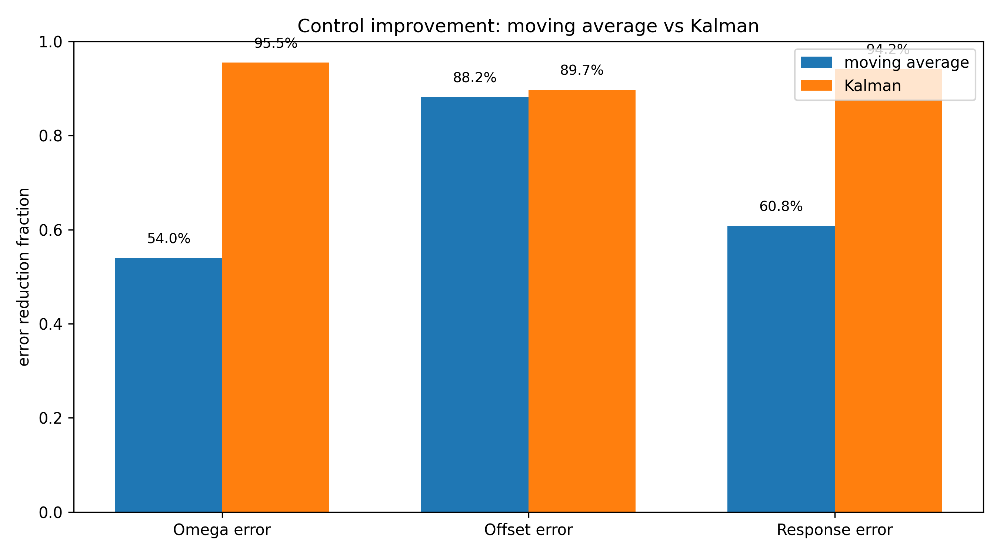
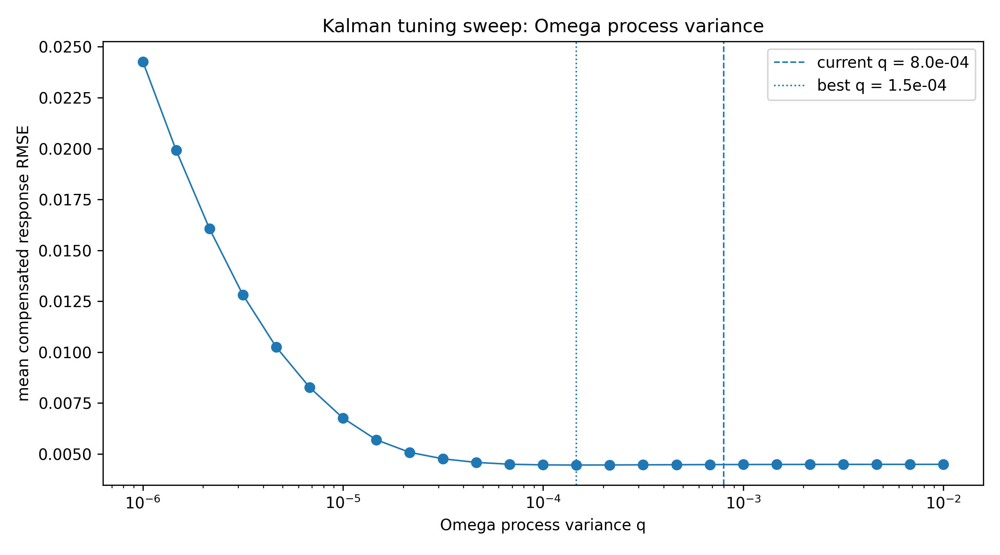

# Kalman Drift Filter (Control Stack)

State-space drift estimation for Rabi frequency (Ω) and readout offset (B).

---

## Pipeline

calibration → drift measurement → Kalman estimate → compensation → stabilized response

This notebook upgrades the first drift-compensation loop by replacing moving-average smoothing with a Kalman state estimator.

---

## Key Results

Kalman filtering improves:

- Ω drift tracking
- response-level stabilization
- CGCS phase-lock margin
- lag reduction vs moving average

---

## Figures

### Response-level error comparison

Kalman control reduces response RMSE to near-zero across calibration blocks, outperforming moving-average compensation.

---

### Frequency (Ω) estimator comparison

Kalman filtering tracks Ω drift with far less lag than the moving-average estimator.

---

### Offset (B) estimator comparison

Kalman filtering smooths offset measurements while preserving the slow drift trend.

---

### Kalman gain trace

Kalman gain shows how strongly each parameter update trusts new calibration measurements.

---

### Frequency error comparison

Kalman compensation nearly eliminates Ω error relative to target.

---

### Offset error comparison

Both moving-average and Kalman control suppress offset drift, with Kalman slightly improving stability.

---

### Example block comparison

A worst-case block shows Kalman compensation closely overlays the target response.

---

### CGCS phase-lock stability

All Kalman-controlled blocks remain phase-locked with cosine similarity near 1.

---

### Improvement summary

Kalman filtering improves Ω, offset, and response-level error reduction relative to moving-average control.

---

### Kalman tuning sweep

Process-noise tuning shows a near-optimal region for Ω drift responsiveness.

---

## Interpretation

Moving-average control reduces error but introduces lag.

Kalman filtering:

- predicts drift as a latent state
- updates from calibration evidence
- reduces lag
- preserves noise rejection
- stabilizes response-level physics

---

## Limitations

Current filter:

- uses independent 1D filters for Ω and B
- does not model Ω/B covariance
- does not yet use one-step-ahead predictive control

---

## Next Step

Benchmark policies:

→ `03_control_policy_comparison.ipynb`

This will compare:

- no compensation
- moving average
- Kalman
- predictive Kalman
- oracle baseline
