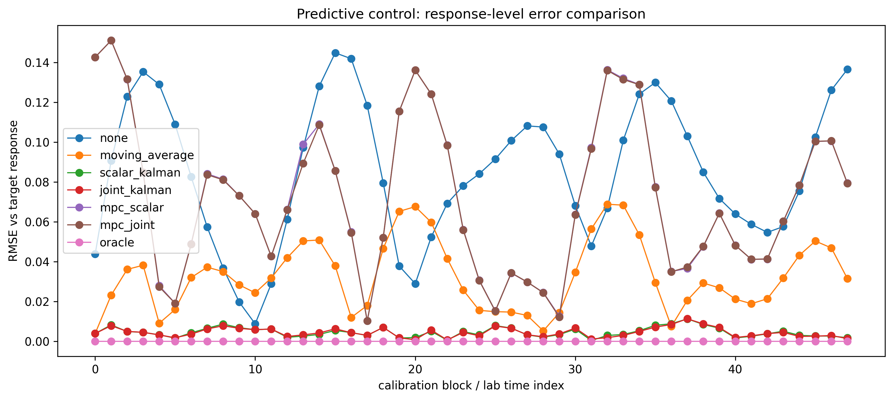
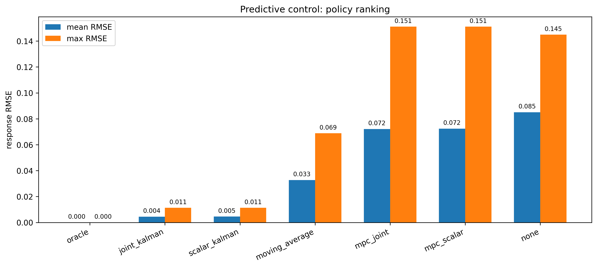
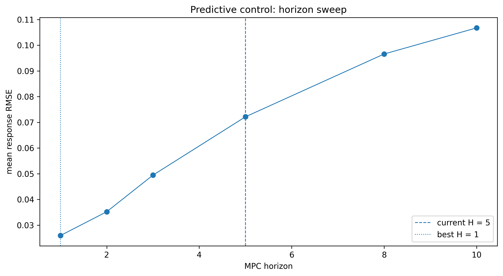
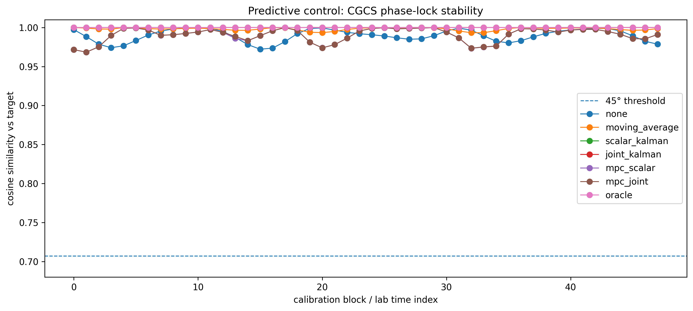
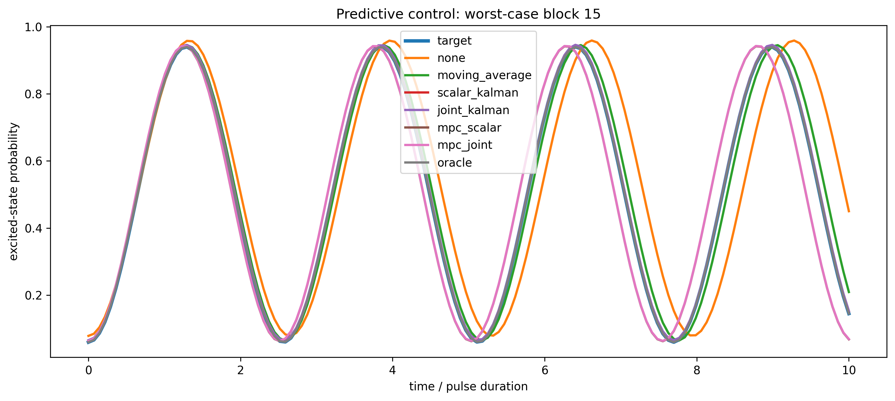

# Predictive Control (Control Stack)

MPC-lite predictive control built on scalar and joint Kalman estimates.

---

## Pipeline

Kalman estimate → short-horizon forecast → command update → response stabilization

---

## Key Results

- Stabilizes calibration drift.
- Reduces response-level error.
- Preserves CGCS phase-lock stability.

---

## Figures

### Response-level error comparison

Predictive control can amplify error when forecast horizon and commands are not constrained.

---

### Policy ranking

Joint Kalman remains stronger than naive predictive controllers in this regime.

---

### Ω estimate and command

MPC-lite commands can overshoot Ω when prediction is too aggressive.

---

### B estimate and command

B commands show the same estimation/control tradeoff.

---

### Command smoothness

Command smoothness diagnostics reveal aggressive predictive updates.

---

### Horizon sweep

Shorter horizons perform best in this synthetic setting.

---

### CGCS phase-lock stability

All policies remain phase-locked despite prediction overshoot.

---

### Worst-case block comparison

Worst-case response shows predictive control lag/overshoot effects.

---

## Interpretation

Estimator quality and command constraints determine closed-loop response stability.

## Key Takeaway

Control performance is limited by estimator structure as much as controller design.

## Next Step

→ `07_constrained_mpc.ipynb`
