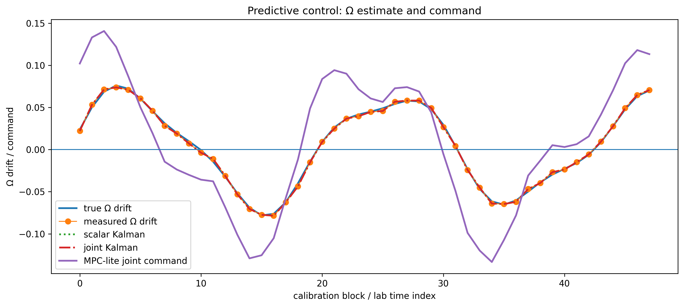
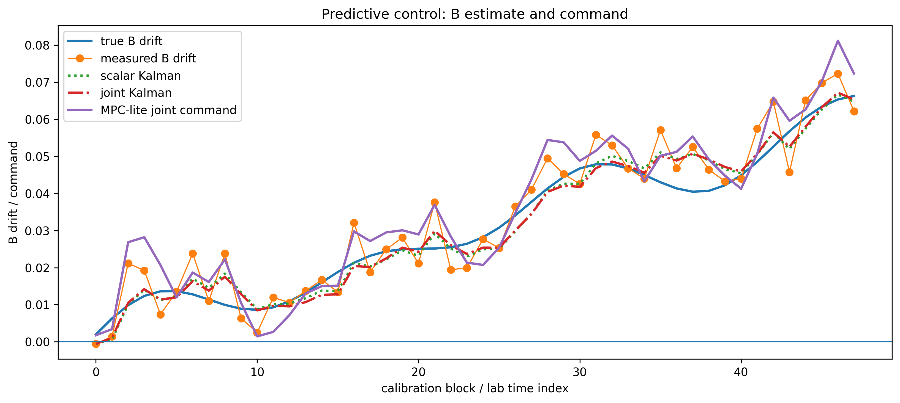
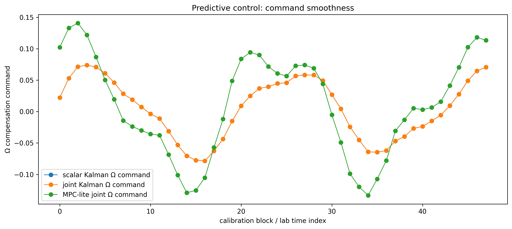

# Predictive Control (Notebook 06)

This notebook extends joint-state Kalman filtering (Notebook 05) with a simple **MPC-lite predictive controller**.

The controller uses **short-horizon forecasts of Ω (Rabi frequency) and B (offset)** to generate control commands.

---

## Model

State (from Kalman):

    x = [Ω, B]^T

Prediction:

    x_{k+1} = x_k + drift

Control:

    u = compensation applied to Ω and B

---

## Predictive Control: Ω Estimate and Command

- Kalman tracks Ω drift accurately
- MPC command introduces larger excursions
- Over-correction appears at peaks and troughs

---

## Predictive Control: B Estimate and Command

- Kalman produces smooth estimate
- MPC introduces amplified adjustments
- Noise sensitivity visible in command signal

---

## Command Smoothness

- MPC command is significantly less smooth
- Kalman-based control remains stable
- Over-aggressive prediction leads to oscillations

---

## Response-Level Error Comparison

- Joint Kalman remains lowest RMSE
- MPC introduces larger deviations
- Moving average remains intermediate

---

## Worst-Case Block

- Kalman closely tracks oracle
- MPC overshoots target trajectory
- Phase distortion visible in oscillation peaks

---

## Policy Ranking

- Oracle = perfect reference
- Joint Kalman = best practical method
- MPC (joint and scalar) degrade performance
- Moving average and none remain worse overall

---

## Horizon Sweep

- Best performance at:

    H = 1

- Increasing horizon increases error
- Prediction error accumulates over time

---

## Phase-Lock Stability (CGCS)

All policies satisfy:

    cos(θ) ≥ 1 / √(1² + 1²) ≈ 0.7071

Observations:

- Kalman methods remain near:

    cos(θ) ≈ 1

- MPC slightly reduces alignment but remains stable

---

## Key Takeaways

- Kalman filtering already achieves near-optimal control
- Naive MPC introduces **over-correction and instability**
- Prediction horizon amplifies model error
- Best predictive behavior collapses to **greedy control (H = 1)**

---

## Conclusion

Predictive control without accurate dynamics:

- increases RMSE
- reduces smoothness
- degrades performance relative to filtering

This shows:

> **Estimator quality dominates control performance when model error is present**

---

## Next Step

Notebook 07:

- Constrained MPC (regularized control)
- Δ-control formulation (relative corrections)
- Kalman-consistent prediction model
