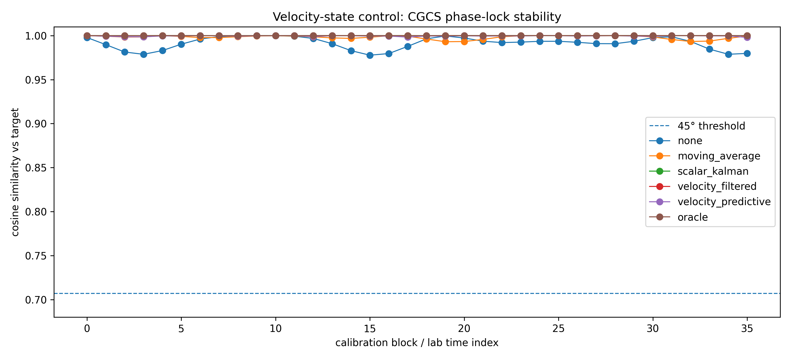
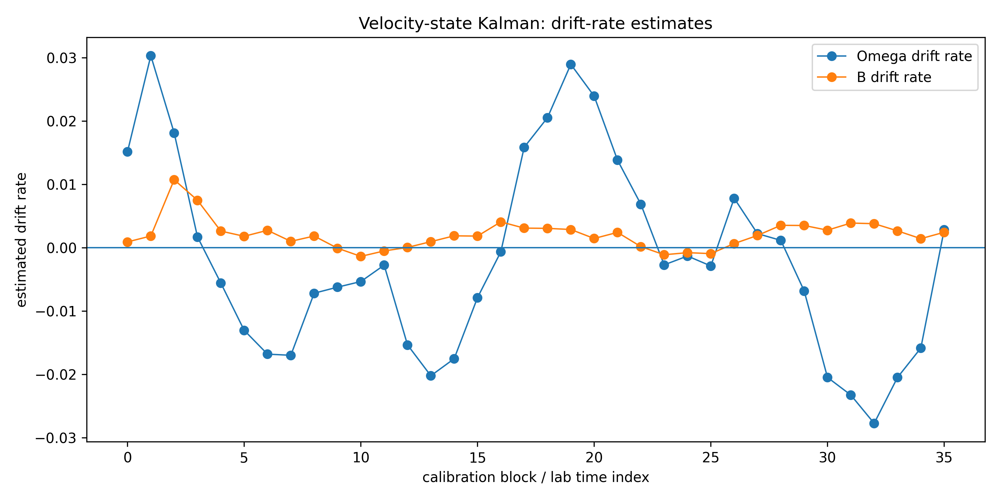
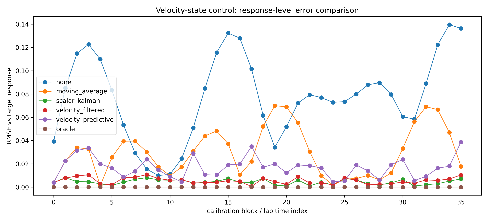
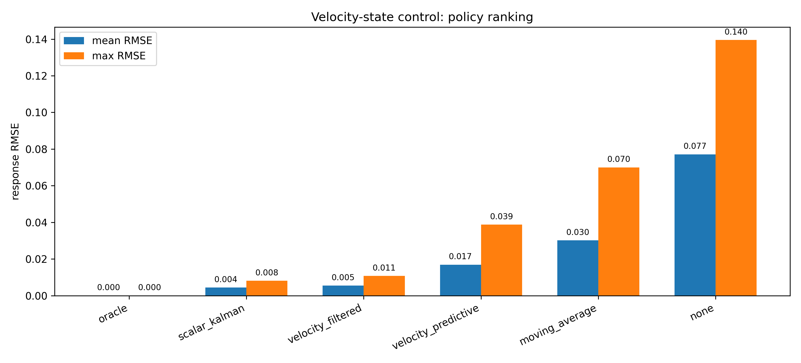
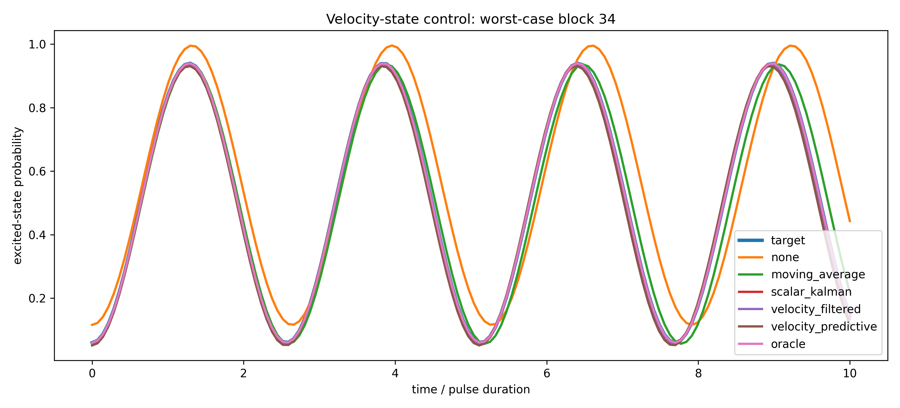
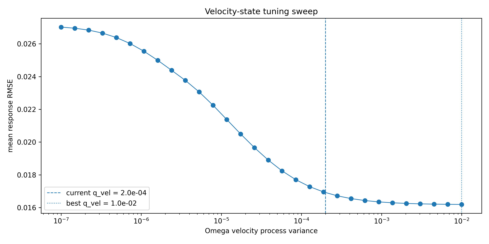

# Velocity-State Kalman (Control Stack)

State-space drift estimation with velocity (rate) modeling.

---

## Pipeline

calibration → drift estimation (state-space) → control update → stabilized response

This notebook upgrades the estimator:

- from scalar drift estimation  
- to velocity-state Kalman filtering

State includes:

- drift (position)
- drift rate (velocity)

---

## Model

State vector:

x = [drift, drift_rate]

Dynamics:

- drift evolves via velocity
- velocity evolves as slow-changing process

This enables:

- smoother estimation
- predictive control capability

---

## Key Results

Velocity-state filtering:

- improves drift tracking vs moving average
- provides interpretable drift-rate estimates
- maintains phase-lock stability

However:

- predictive control depends strongly on model accuracy
- simple velocity model introduces mismatch under nonlinear drift

---

## Figures

### CGCS phase-lock stability

- All policies remain phase-locked
- Scalar Kalman and velocity-filtered are near-perfect
- Predictive mode shows slight degradation but remains stable

---

### Drift-rate estimates

- Ω drift shows oscillatory behavior
- B drift is slower and smoother
- Velocity-state model captures structure beyond scalar filtering

---

### Response-level error comparison

- Scalar Kalman achieves lowest error
- Velocity-filtered close behind
- Predictive control increases error under model mismatch

---

### Policy ranking

- oracle → best possible
- scalar Kalman → best practical
- velocity-filtered → slightly worse
- predictive → degraded due to model assumptions

---

### Worst-case block comparison

- Predictive control introduces phase lead / overshoot
- Filtered approaches remain aligned with target

---

### Velocity tuning sweep

- Increasing velocity process noise improves performance
- Optimal region indicates model uncertainty dominates

---

## Interpretation

Velocity-state Kalman filtering:

- exposes drift dynamics (rate of change)
- improves interpretability of calibration drift
- enables predictive control

But:

- system drift is not strictly constant-velocity
- model mismatch limits predictive performance
- filtering (not prediction) remains optimal under current assumptions

---

## Limitations

Current model:

- assumes constant or slowly varying drift rate
- does not capture higher-order dynamics
- treats Ω and B independently

Predictive control:

- sensitive to model mismatch
- requires accurate process model to outperform filtering

---

## Key Insight

Adding velocity state increases observability, not necessarily performance.

Best results occur when:

- model assumptions match system dynamics
- or process noise compensates for mismatch

---

## Next Step

Upgrade model complexity:

→ joint-state Kalman (Ω + B coupled)

or

→ higher-order dynamics (acceleration)

or

→ residual-based modeling

Goal:

- reduce model mismatch
- improve predictive control
- preserve phase-lock stability
