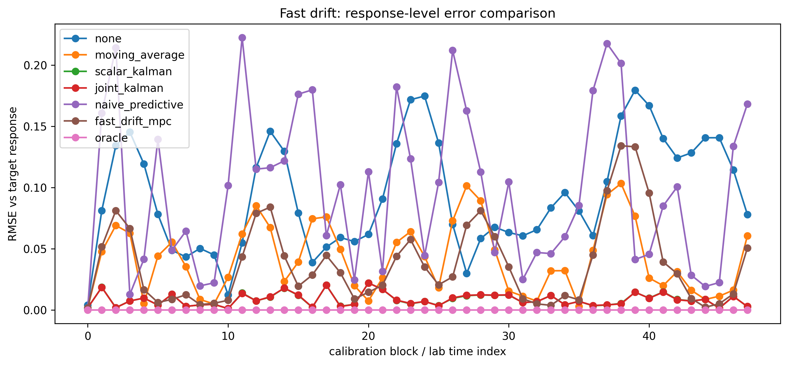
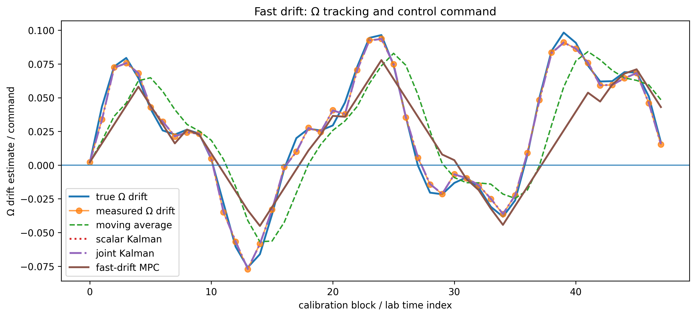
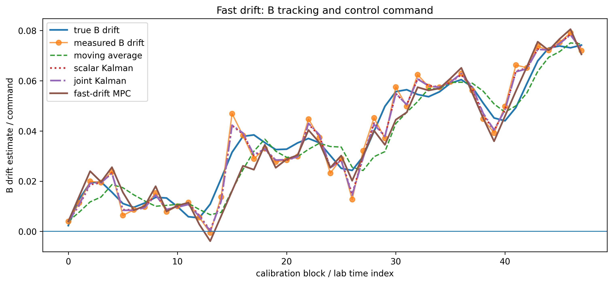
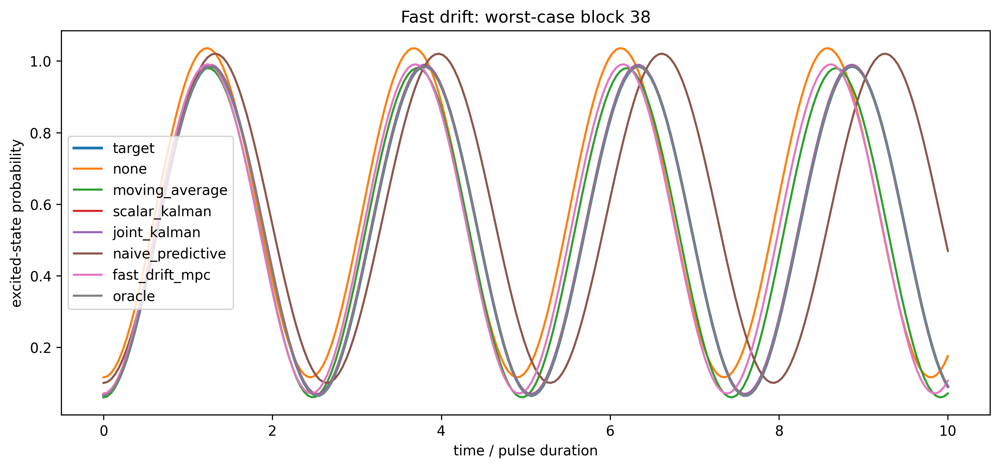
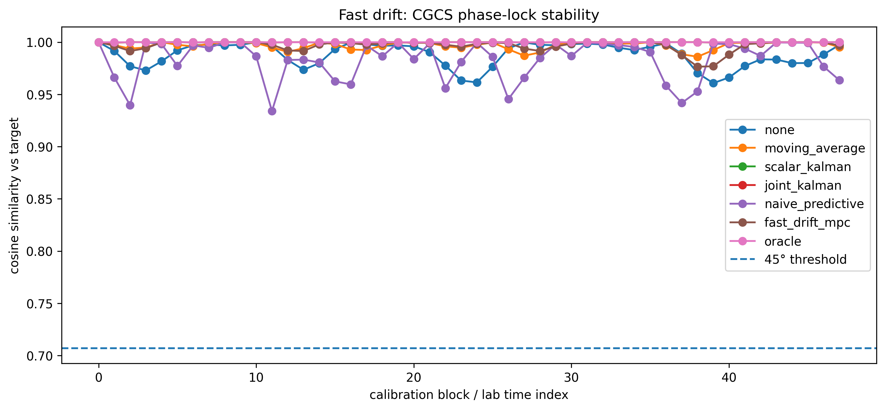
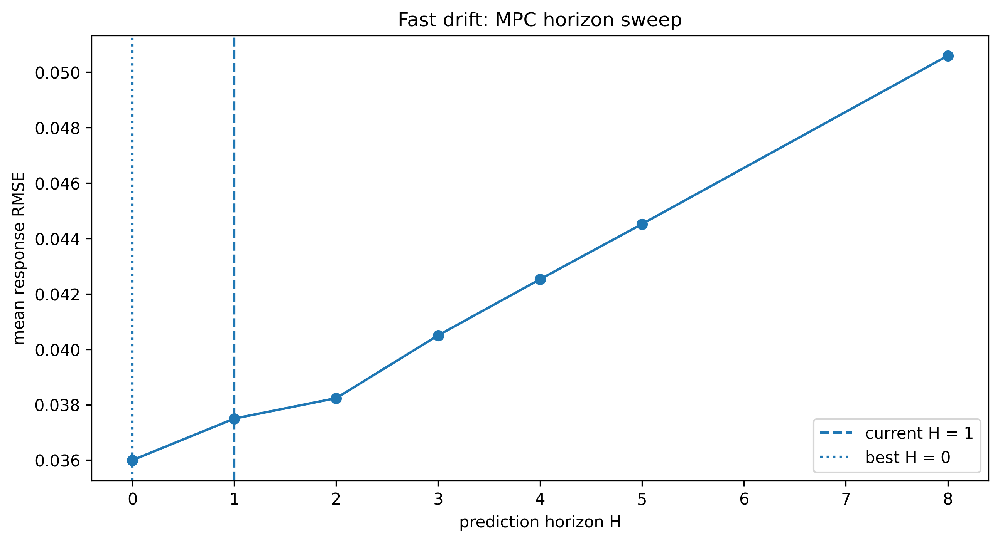
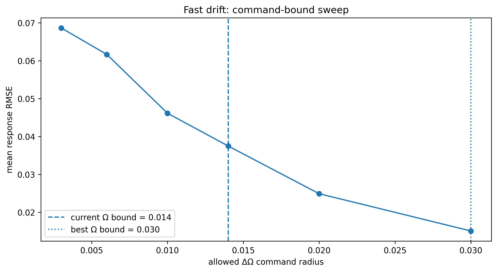

# Results — Fast Drift MPC vs Kalman

Fast-drift regime comparing estimation and control performance under rapid Ω and B variation.

---

## Summary

Fast drift shifts the problem into an **estimation-dominated regime**:

- Kalman filtering provides optimal tracking
- Predictive control alone is unstable
- MPC improves stability under constraints but does not outperform Kalman in accuracy

---

## Control policy ranking

| Policy            | Mean RMSE | Max RMSE |
|------------------|----------:|----------:|
| oracle           | 0.0000 | 0.0000 |
| scalar_kalman    | 0.0085 | 0.0221 |
| joint_kalman     | 0.0085 | 0.0220 |
| fast_drift_mpc   | 0.0375 | 0.1341 |
| moving_average   | 0.0416 | 0.1032 |
| none             | 0.0932 | 0.1795 |
| naive_predictive | 0.0976 | 0.2225 |

---

## Response-level error comparison

- Kalman filters achieve lowest RMSE  
- MPC reduces spikes relative to naive predictive  
- Naive predictive shows large excursions  

---

## Ω tracking and control

- Kalman tracks drift with minimal lag  
- Moving average lags  
- MPC smooths response but slightly under-tracks peaks  

---

## B (offset) tracking

- Joint Kalman captures coupled dynamics  
- MPC produces smooth control  
- Moving average underperforms  

---

## Worst-case block behavior

- Naive predictive overshoots strongly  
- MPC remains bounded  
- Kalman remains closest to target  

---

## CGCS phase-lock stability

Constraint:

    cos(θ) ≥ 1 / √(1² + 1²) ≈ 0.7071

Observed:

- scalar_kalman: mean ≈ 0.99990  
- joint_kalman: mean ≈ 0.99990  
- fast_drift_mpc: mean ≈ 0.99676  
- naive_predictive: min ≈ 0.934  

All methods remain phase-locked, but predictive control approaches instability.

---

## MPC horizon sweep

| Horizon H | Mean RMSE |
|----------:|----------:|
| 0 | 0.0360 |
| 1 | 0.0375 |
| 2 | 0.0382 |
| 3 | 0.0405 |
| 4 | 0.0426 |
| 5 | 0.0445 |
| 8 | 0.0507 |

Best performance at **H = 0**.

**Insight:**

- Fast drift favors **reactive control**
- Prediction horizon introduces lag

---

## Command-bound sweep

| ΔΩ bound | Mean RMSE |
|---------:|----------:|
| 0.004 | 0.069 |
| 0.006 | 0.061 |
| 0.010 | 0.046 |
| 0.014 | 0.037 |
| 0.020 | 0.025 |
| 0.030 | 0.015 |

Best performance at:

    ΔΩ ≈ 0.03

**Insight:**

- Larger control authority improves tracking
- Overly tight bounds limit responsiveness

---

## Key insight

Fast drift regime:

- **Estimation dominates control**
- Kalman filtering is optimal baseline
- MPC improves robustness under constraints
- Predictive-only control is unstable

---

## Position in control stack

- 06 → parameter phase diagram  
- 07 → constrained MPC (slow drift)  
- **08 → fast drift regime**

---

## Next

- Coupled Ω + B control  
- Multi-parameter MPC  
- CGCS constraint boundary failure modes  
